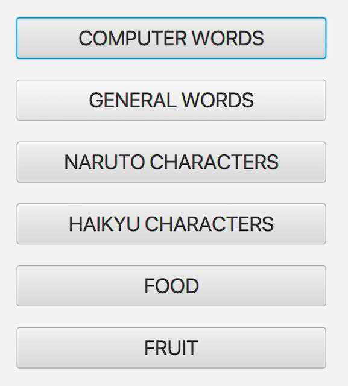
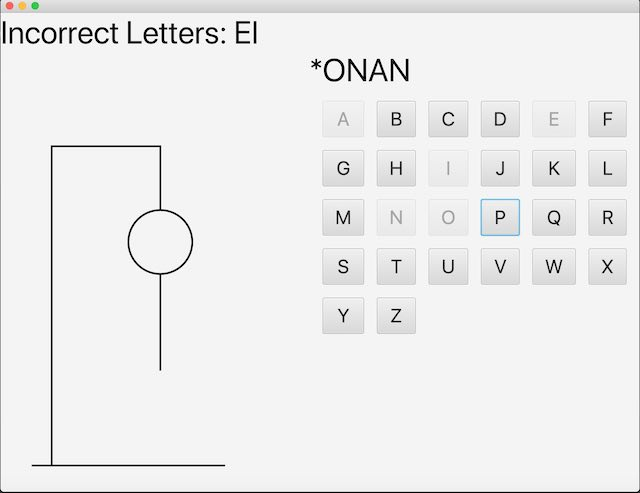
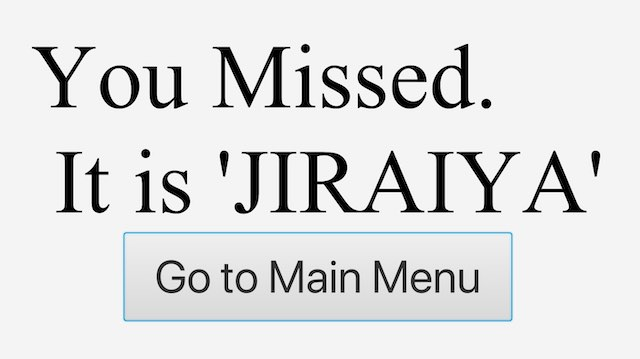

# Project Name: HangMan

## Author: 
#### name: Ibrahim (Wusiman Yibulayin)
#### student ID: 0728356

## Table of contents
* [Description](#description)
* [Console Mode](#console-mode)
* [GUI Mode](#gui-mode:)

## Description
This is a hangman project. This project includes two modes: 
Console and GUI. Only the compiler can switch the two modes of program. 
Console Mode: In main method of program, there are two lines: 
        
        
gameConsole();

        
Application.launch(args);

        
The current mode is console mode, because program invokes gameConsole 
and end with function System.exit(0); 
GUI Mode:
If we commit first line as  
// gameConsole(); 
Program will invode Application.launch() function and starts to 
go to JavaFX GUI program.

## Console Mode
Player can play with keyboard in console mode. System will display 
a menu with 6 different types: 
1) COMPUTER WORDS 
2) GENERAL WORDS 
3) NARUTO CHARACTERS 
4) HAIKU CHARACTERS 
5) FOOD 
6) FRUIT 

player can select one of them. After the selection, system will 
randomly generate a word to guess. The word length will be displayed 
with star(*). When player enter a letter to guess. system will check if it is
correct. System will put the letter to the correct place if player 
guessed correctly. System will display an error message if player
entered a wrong letter. The system can prompt if player entered gessed 
letter. Player only has 7 chance to guess. If player spent all of their
chance, the system will exit the guess process and display the 
result.

## GUI Mode
Like console mode, there are the select chance of 6 different categories:

After selection, system will randomly generate a word and display
keyboard to select letters. If player guessed correctly, the letter 
will be placed in the top of keyboard are. If player guessed a wrong letter,
The letter will be displayed at the top of the screen. 

If the player Guessed all letters int the word, player will win. 
If player guessed seven wrong letter, player will lose.

